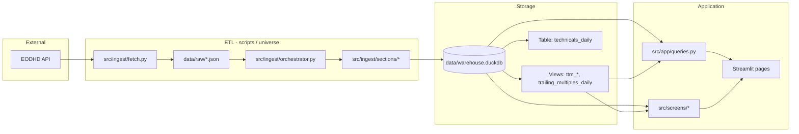

# Code Tutorial — Fundamentals Dashboard

This document is a guided tour of the repository for someone seeing it for the
first time. It assumes you are comfortable with Python, SQL, and basic data
pipelines, but not necessarily with DuckDB, Streamlit, or EODHD.

For design rules, conventions, and anti-patterns, see **`AGENTS.md`** (the living
design doc). For what shipped and what is planned, see **`PLAN.md`**. For a quick
operational start, see **`README.md`**.

---

## Table of contents

1. [What this project does](#1-what-this-project-does)
2. [Architecture at a glance](#2-architecture-at-a-glance)
3. [Libraries you will encounter](#3-libraries-you-will-encounter)
4. [Repository layout](#4-repository-layout)
5. [Configuration and secrets](#5-configuration-and-secrets)
6. [The warehouse: schema, migrations, views](#6-the-warehouse-schema-migrations-views)
7. [Ingestion: from API to tables](#7-ingestion-from-api-to-tables)
8. [Derived metrics: compute layer](#8-derived-metrics-compute-layer)
9. [Universe and watchlists](#9-universe-and-watchlists)
10. [Screens: filtering the universe](#10-screens-filtering-the-universe)
11. [The Streamlit app](#11-the-streamlit-app)
12. [Scripts and day-to-day operations](#12-scripts-and-day-to-day-operations)
13. [Tests](#13-tests)
14. [How to trace a feature end-to-end](#14-how-to-trace-a-feature-end-to-end)
15. [Common pitfalls (short list)](#15-common-pitfalls-short-list)
16. [Further reading](#16-further-reading)

---

## 1. What this project does

This is a **personal equity fundamentals dashboard**. You maintain a list of
stock tickers (“the universe”), pull data from the vendor **EODHD**, store it in
a local **DuckDB** database, and explore it through a **Streamlit** web UI.

Four main capabilities:

| Capability | What it means in code |
|------------|------------------------|
| **Universe management** | `src/universe.py`, Universe page, `scripts/add_ticker.py` |
| **Drill-down** | Deep Dive page + `queries.py` (statements, prices, analyst data) |
| **Screens** | `src/screens/*` + Screens / Forward / Technical pages |
| **Watchlists** | `src/watchlist.py` — named subsets that filter *display* only |

The mental model: **ETL is separate from the UI**. Almost everything the
dashboard shows is read from DuckDB. The main exception is adding a ticker from
the UI, which triggers a live API fetch via `add_ticker()`.

---

## 2. Architecture at a glance

Data moves in one direction for daily use: **vendor → raw JSON files → parsed
rows in DuckDB → SQL views → Python screens/queries → Streamlit**.



**Single-writer rule:** DuckDB allows one writer at a time. Do not run
`load_daily.py` while Streamlit (or another writer) holds the database open for
writes. The default cron suggestion (02:00) avoids that conflict.

**Re-download everything:** Each daily load fetches the **full** fundamentals
and price history per ticker, writes JSON under `data/raw/`, then UPSERTs into
DuckDB. Bandwidth is cheap; incremental sync is intentionally avoided.

---

## 3. Libraries you will encounter

| Library | Role here |
|---------|-----------|
| **uv** | Dependency and virtualenv manager (`uv sync`, `uv run …`) |
| **DuckDB** | Embedded analytical database; one file `data/warehouse.duckdb` |
| **pandas** | Building DataFrames during ingest; returning query results to Streamlit |
| **polars** | Available for heavier query-side work; not dominant in current code |
| **httpx** | Synchronous HTTP client for EODHD (`src/ingest/fetch.py`) |
| **Streamlit** | Multi-page web UI under `src/app/` |
| **plotly** | Charts on Deep Dive and related pages |
| **pytest** | Tests in `tests/`, often using fixture JSON under `tests/fixtures/` |
| **python-dotenv** | Loads `EODHD_API_TOKEN` from `.env` in scripts and some pages |
| **PyYAML** | `config/settings.yml` for paths, throttles, benchmark ticker |

You do not need to be an expert in any of these to follow the code; the patterns
are repetitive once you see one ingest module and one query function.

---

## 4. Repository layout

```
fundamentals/
├── config/
│   ├── settings.yml      # paths, rate limits, benchmark (not secrets)
│   └── universe.yml      # SEED list only — not runtime source of truth
├── data/
│   ├── raw/fundamentals/ # <TICKER>.json from vendor (replaced daily)
│   ├── raw/prices/       # <TICKER>.json daily OHLCV series
│   ├── archive/          # optional dated copies for audit
│   ├── logs/             # cron / bulk load logs
│   └── warehouse.duckdb  # the database (created on first open)
├── src/
│   ├── schema/           # migrations + open_db()
│   ├── ingest/           # fetch, orchestrator, per-section parsers
│   ├── compute/          # SQL views + technicals table rebuild
│   ├── screens/          # screen logic (SQL + pandas filters)
│   ├── universe.py       # add/remove/list tickers
│   ├── watchlist.py      # watchlist CRUD
│   ├── ticker_input.py   # shared ticker list parser
│   └── app/              # Streamlit: Home.py, pages/, queries.py, sidebar.py
├── scripts/              # CLI entry points (load, seed, bulk, add)
└── tests/                # phase-numbered integration tests + fixtures
```

**Import convention:** Scripts add the project root to `sys.path` and import
as `from src.ingest...`. The package root is `src/` (see `pyproject.toml`).

**Streamlit pages:** Files under `src/app/pages/` are numbered so Streamlit
orders them in the sidebar (`1_Deep_Dive.py`, `2_Universe.py`, …). The entry
point is `src/app/Home.py`.

---

## 5. Configuration and secrets

| Source | Purpose |
|--------|---------|
| `.env` | `EODHD_API_TOKEN` (never commit; copy from `.env.example`) |
| `config/settings.yml` | Warehouse path, raw paths, `requests_per_second`, bulk-load RPM, benchmark ticker |
| `config/universe.yml` | Initial tickers for **one-time** seeding via `scripts/seed_universe.py` |

**Runtime source of truth for tickers:** the `universe` table in DuckDB, not
the YAML file.

**Warehouse path:** `schema.runner.warehouse_path()` reads `settings.yml` and
can be overridden with the `WAREHOUSE_PATH` environment variable. Scripts and
the UI should always use this helper — not a hard-coded relative path from the
current working directory.

---

## 6. The warehouse: schema, migrations, views

### 6.1 Opening the database

Every process that needs the DB should call:

```python
from src.schema.runner import open_db, warehouse_path

con = open_db(warehouse_path())
# ... work ...
con.close()
```

`open_db()` does three things:

1. Connects to the DuckDB file.
2. Runs any pending SQL files in `src/schema/migrations/` (tracked in
   `_schema_migrations`).
3. Calls `src.compute.setup_views(con)` to create or replace **views**.

### 6.2 Cadence-aware tables

Data is split by **how often it changes**, not one giant “ticker × day” table:

| Cadence | Examples | Grain |
|---------|----------|--------|
| User / static | `universe`, `security_master` | per ticker |
| Quarterly / annual | `quarterly_fundamentals`, `income_statement`, … | per ticker × period |
| Event | `earnings_events`, `dividends_declared`, `splits` | per event |
| Daily | `prices_daily`, `daily_forward_snapshot`, `technicals_daily` | per ticker × date |

See `001_initial.sql` for column-level definitions. Later migrations (`002`–
`007`) add monitoring, watchlists, `period_type` on statements, analyst trend
columns, `load_runs` PK fix, and the `technicals_daily` **table**.

### 6.3 UPSERT and idempotency

Ingest modules use `upsert_df()` in `src/ingest/sections/_util.py`:

- Build a pandas DataFrame for one logical section.
- `INSERT … ON CONFLICT (primary key) DO UPDATE` via a temporary registered
  table.
- Set `loaded_at` on every write.

Re-running ingest on the same JSON should leave the warehouse in the same state
(modulo `loaded_at`). That makes daily full re-downloads safe.

### 6.4 Views vs stored derived data

**Principle:** Market cap, trailing P/E, moving averages, etc. are **derived**
in SQL views, not stored as authoritative columns from the vendor.

Views are defined in Python under `src/compute/` and recreated on every
`open_db()`:

| View | Defined in | Purpose |
|------|------------|---------|
| `ttm_eps`, `ttm_revenue`, `ttm_ebitda`, `ttm_fcf` | `compute/ttm.py` | Rolling 4-quarter sums |
| `trailing_multiples_daily` | `compute/multiples.py` | P/E, P/S, P/B, EV/EBITDA, FCF yield by trading day |
| `universe_size_latest` | `compute/size.py` | Latest market cap and 20-day ADV |

**Exception:** `technicals_daily` is a **table** (migration `007`) because RSI,
MACD, ATR, and EMAs need recursive/EWM logic that is awkward in pure SQL. It is
**fully regenerable** from `prices_daily` via `recompute_technicals()` and is
never written by anything else. See `TECHNICALS.md` for indicator details.

### 6.5 Point-in-time joins

Historical multiples must use fundamentals only when they were **knowable**.
Quarters are knowable on **`report_date`** (filing date), not fiscal period end.

The canonical pattern is DuckDB’s **`ASOF LEFT JOIN`**:

```sql
FROM prices_daily p
ASOF LEFT JOIN ttm_eps ttm
  ON p.ticker = ttm.ticker AND p.date >= ttm.report_date
```

`trailing_multiples_daily` chains several ASOF joins (shares, TTM metrics,
balance sheet). If you add a new time-varying fundamental, follow this pattern.

---

## 7. Ingestion: from API to tables

### 7.1 HTTP layer — `src/ingest/fetch.py`

- Reads API token from `EODHD_API_TOKEN`.
- Appends `.US` (or `vendor.default_exchange`) to bare tickers like `AAPL`.
- Two main endpoints:
  - `/api/fundamentals/<ticker>` → large nested JSON dict
  - `/api/eod/<ticker>?period=d` → list of daily OHLCV rows
- Validates responses: EODHD can return HTTP 200 with `{"Error": "..."}`.
- Rate limiting and retries live in `_get()` — do not bypass for ad-hoc calls.

### 7.2 Orchestrator — `src/ingest/orchestrator.py`

Central coordination:

| Function | When it runs |
|----------|----------------|
| `fetch_and_ingest(con, ticker)` | Download (if not already fresh today), archive optionally, parse, load, recompute technicals for that ticker, log `load_runs` |
| `ingest_ticker(con, fund_path, price_path)` | Parse existing JSON only (tests, replays) |
| `ingest_universe(con)` | Loop active tickers; failures isolated per ticker |
| `refresh_universe_threaded(con)` | Parallel HTTP fetches, **serial** DuckDB writes (Universe “Refresh All”) |

**Section loop:** `_SECTIONS` is an ordered list of `(name, ingest_fn)` pairs.
Each function receives `(con, ticker, data)` where `data` is the parsed
fundamentals dict; prices are injected as `data["_prices"]` when a price file
is provided.

A failure in one section is logged; other sections still run.

### 7.3 Section modules — `src/ingest/sections/`

One file per vendor area. Typical structure:

1. Navigate nested JSON (`data["Financials"]["Income_Statement"]["quarterly"]`).
2. Map vendor camelCase → snake_case with `col()`.
3. Coerce types with `to_float`, `to_date`, etc.
4. Build a DataFrame and `upsert_df(..., pk=[...])`.

| Module | Target table(s) |
|--------|-----------------|
| `general.py` | `security_master`, `quarterly_fundamentals` (from Highlights) |
| `financials.py` | `income_statement`, `balance_sheet`, `cash_flow` |
| `earnings.py` | `earnings_events` |
| `shares.py` | `shares_outstanding` |
| `dividends.py` | `dividends_annual`, `dividends_declared`, `splits` |
| `analyst_snapshot.py` | `daily_forward_snapshot`, `analyst_estimates_history` |
| `prices.py` | `prices_daily` |

**Field normalization** is centralized in `_util.py`:

- `col("MarketCapitalization")` → `market_capitalization`
- Known vendor typos are fixed in `_RENAMES`.

**Currency:** monetary tables store amounts in the issuer’s currency with a
`currency` column. `ingest_highlights` raises if `General.CurrencyCode` is
missing rather than defaulting to USD.

**Statements:** `period_type` is `'quarterly'` or `'annual'`. Always filter on
it in queries — the same fiscal period end can exist twice.

**Adjusted close:** On each price load, `adjusted_close` is overwritten for the
entire history (vendor back-adjusts for splits/dividends). Raw OHLC is left as
historically reported.

### 7.4 Raw files and archive

Paths come from `config/settings.yml`:

- `data/raw/fundamentals/<TICKER>.json`
- `data/raw/prices/<TICKER>.json`

If `ingest.archive_raw_files` is true, copies land under
`data/archive/<YYYY-MM-DD>/`.

`_fresh_today()` skips re-fetching if the file was already written today (cron
efficiency). “Refresh All” in the UI uses `_fetch_ticker_files`, which always
hits the API.

---

## 8. Derived metrics: compute layer

### 8.1 TTM views — `src/compute/ttm.py`

Trailing twelve months metrics sum **four consecutive quarters** using SQL
window functions over `earnings_events` or `income_statement` / `cash_flow`,
joined to `report_date` from earnings where needed.

Output grain: `(ticker, report_date, ttm_*)` — one row per “as-of” reporting
event, not per calendar day.

### 8.2 Trailing multiples — `src/compute/multiples.py`

Joins daily `prices_daily` to the latest knowable TTM, shares, and balance
sheet via ASOF joins, then computes:

- `pe_trailing`, `ps_trailing`, `pb_trailing`, `ev_ebitda_trailing`, `fcf_yield`

Net debt for EV uses:

`long_term_debt_total + short_term_debt - cash_and_short_term_investments`

(with COALESCE to zero for missing components).

### 8.3 Technicals — `src/compute/technicals.py`

After prices load, `fetch_and_ingest` calls `recompute_technicals(con, [ticker])`.
Bulk refresh recomputes for all active tickers.

The UI and technical screens read `technicals_daily`; they do **not** auto-update
when prices change until recompute runs.

---

## 9. Universe and watchlists

### 9.1 Universe — `src/universe.py`

| Function | Behavior |
|----------|----------|
| `add_ticker(con, ticker, notes?)` | Insert pending row (`active=false`) → `fetch_and_ingest` → set `active=true`; rollback row on failure |
| `remove_ticker(con, ticker)` | Soft delete: `active=false`, data retained |
| `list_universe(con)` | DataFrame of universe rows |
| `bulk_add_tickers(con, tickers)` | Per-ticker try/continue |
| `seed_from_config(con, yaml_path)` | Add tickers from YAML if not already present |

CLI: `scripts/add_ticker.py`. UI: Universe page calls the same `add_ticker()`.

### 9.2 Watchlists — `src/watchlist.py`

Watchlists are **snapshots**: saving from a screen captures tickers at that
moment; they do not auto-sync when the universe changes.

Schema: `watchlist` + `watchlist_membership` (optional `shares`, `cost_basis`
for future portfolio mode).

### 9.3 Display set ≠ comparison set

Important UX rule:

- **Display set:** which rows you *see* (optional watchlist filter).
- **Comparison set:** medians, percentiles, sector aggregates — always over the
  **full active universe** unless a function explicitly takes `comparison_set`.

The sidebar helper `app/sidebar.watchlist_selector()` returns `None` (full
universe) or `list[str]` of tickers. Screen functions take `display_filter` and
apply it **last** in pandas:

```python
if display_filter is not None:
    df = df[df["ticker"].isin(display_filter)]
```

Sector median screens compute over all active tickers first, then filter display.

---

## 10. Screens: filtering the universe

Screen logic lives in `src/screens/`, not in Streamlit pages. Pages collect
widget inputs, call a screen function, and render the DataFrame.

| Module | Screens |
|--------|---------|
| `trailing.py` | Absolute valuation, relative-to-own-history, growth, quality, balance sheet, income |
| `sectors.py` | Sector medians and constituents |
| `forward_vendor.py` | EPS revisions, net upward revisions, beat-and-raise (vendor trend fields) |
| `forward_history.py` | Rating shift, target raised (needs ~30 days of `daily_forward_snapshot`) |
| `technicals.py` | MA crosses, RSI zones, MACD, 52-week proximity, etc. |

Pattern:

1. Run a (often large) SQL query in DuckDB → pandas DataFrame.
2. Apply threshold filters in Python (slider values from the UI).
3. Apply `display_filter` if present.

Relative-history screens use `PERCENT_RANK() OVER (PARTITION BY ticker …)` in
DuckDB — note that PostgreSQL’s `WITHIN GROUP` variant is **not** supported.

---

## 11. The Streamlit app

### 11.1 Layering

```
pages/*.py          → widgets, layout, calls to queries/screens
queries.py          → ALL SQL for the UI (pages should not embed SQL)
sidebar.py          → shared watchlist selector
Home.py             → landing / universe summary
```

Keeping SQL in `queries.py` makes behavior testable and avoids duplication across
pages.

### 11.2 Connection and caching

Typical page pattern:

```python
@st.cache_resource
def _get_con():
    return queries.open_warehouse()

@st.cache_data
def _load_data(_con, mtime: float):
    return queries.some_function(_con)
```

`warehouse_mtime()` invalidates caches when the DB file changes on disk.

### 11.3 Pages (sidebar order)

| File | Purpose |
|------|---------|
| `Home.py` | Universe summary table with conditional formatting |
| `1_Deep_Dive.py` | Single-ticker history, statements, analyst, earnings |
| `2_Universe.py` | Add/remove/refresh/bulk; load status; price modal |
| `3_Screens.py` | Trailing fundamental screens |
| `4_Watchlists.py` | Create/manage watchlists |
| `5_Sectors.py` | Sector aggregates |
| `6_Forward_Screens.py` | Forward estimate and snapshot-history screens |
| `7_Technical_Screens.py` | Technical indicator screens |

Deep Dive uses `st.dialog` for modals in places; prefer `width="stretch"` over
deprecated `use_container_width=True`.

### 11.4 When the UI touches the vendor

Almost never. Exceptions:

- Universe page “add ticker” / refresh → `universe.add_ticker` /
  `orchestrator.refresh_universe_threaded`
- Those code paths need `load_dotenv()` so `EODHD_API_TOKEN` is set

Everything else reads DuckDB only.

---

## 12. Scripts and day-to-day operations

| Script | Role |
|--------|------|
| `scripts/seed_universe.py` | First-time populate from `config/universe.yml` |
| `scripts/load_daily.py` | Cron entry: `ingest_universe` for all `active` tickers |
| `scripts/add_ticker.py` | CLI wrapper around `add_ticker()` |
| `scripts/bulk_load.py` | Rate-limited bulk add with `bulk_load_jobs` checkpoint/resume |
| `scripts/rebuild.py` | Re-ingest from raw files / recompute technicals (maintenance) |

**Bulk load** (`src/ingest/bulk.py`): creates a `job_id`, tracks per-ticker
`pending` / `ok` / `failed`, respects `bulk_load.requests_per_minute` in
settings. Resume with `--resume <job_id>`.

**Docker / Makefile:** `docker-compose.yml` mounts `./data` and `./.env`;
`make load`, `make ui`, `make test` wrap common commands.

---

## 13. Tests

Tests live under `tests/` and are named by **build phase** (`test_phase1.py`,
…), plus `test_smoke.py` and `test_technicals.py`.

Fixtures:

- `tests/fixtures/AAPL-Fundamentals.json`
- `tests/fixtures/AAPL.json` (prices)

Typical test flow:

1. Create a temporary DuckDB (or in-memory).
2. Run migrations / `open_db`.
3. `ingest_ticker` from fixture paths.
4. Assert row counts, view outputs, date-lag behavior, or display-filter
   invariants.

When you change ingest or views, run:

```bash
uv run pytest
uv run ruff check . && uv run black --check .
```

---

## 14. How to trace a feature end-to-end

Use these recipes when you are debugging or extending behavior.

### “Where does trailing P/E on Home come from?”

1. `src/app/Home.py` → `queries.universe_summary()`
2. SQL in `queries.py` joins `trailing_multiples_daily` (latest date per ticker)
3. View defined in `src/compute/multiples.py` ← depends on `ttm_eps` view
4. `ttm_eps` in `src/compute/ttm.py` ← `earnings_events` table
5. `earnings_events` ← `src/ingest/sections/earnings.py` ← EODHD JSON

### “I added a ticker; what runs?”

1. UI or CLI → `universe.add_ticker()`
2. → `orchestrator.fetch_and_ingest()`
3. → `fetch_fundamentals` + `fetch_prices` → raw JSON
4. → `ingest_ticker()` → each section module
5. → `recompute_technicals()`
6. → `load_runs` row

### “I want a new column on a screen”

1. Confirm the data exists in a table (or add ingest + migration if not).
2. If derived historically, prefer a view in `src/compute/`.
3. Add SQL to the relevant `src/screens/*.py` function (or `queries.py` for UI-only).
4. Wire widgets on the Streamlit page.
5. Add a test that pins the new behavior.

### “I want a new stored vendor field”

1. Check `AGENTS.md` “Explicitly NOT tracked” — some areas are intentionally omitted.
2. Add column via new migration in `src/schema/migrations/` (never edit old migrations).
3. Map field in the appropriate `src/ingest/sections/*.py` using `col()`.
4. Extend tests and any screen/query that should show it.

---

## 15. Common pitfalls (short list)

| Pitfall | Instead |
|---------|---------|
| Using `fiscal_period_end` for point-in-time joins | Use `report_date` |
| Storing vendor trailing P/E or market cap as truth | Compute via views |
| Filtering medians/percentiles by watchlist | Filter display rows only |
| Querying statements without `period_type` | Always `WHERE period_type = 'quarterly'` (or `'annual'`) |
| Trusting EODHD HTTP 200 without shape check | Use `fetch.py` validators |
| Running daily load during active Streamlit writes | Schedule off-hours |
| Expecting `technicals_daily` to update with prices alone | Call `recompute_technicals()` |
| Duplicating ticker parsing | Use `parse_ticker_input()` |
| `python -c` with `#` comments in shell | Use a `.py` file or heredoc (see `AGENTS.md`) |

---

## 16. Further reading

| Document | Contents |
|----------|----------|
| **`AGENTS.md`** | Full design principles, data model table, anti-patterns |
| **`PLAN.md`** | Backlog and decision log |
| **`REVIEW.md`** | Snapshot code review |
| **`TECHNICALS.md`** | Indicator definitions and warm-up behavior |
| **`README.md`** | Quickstart, Docker, cron examples |

---

## Quick reference: main entry points

| Task | Entry point |
|------|-------------|
| Open DB | `src.schema.runner.open_db` |
| Daily ETL | `scripts/load_daily.py` → `ingest_universe` |
| Add one ticker | `src.universe.add_ticker` |
| Parse vendor JSON | `src.ingest.orchestrator.ingest_ticker` |
| HTTP | `src.ingest.fetch` |
| SQL views | `src.compute.setup_views` |
| UI SQL | `src.app.queries` |
| Screens | `src/screens/*` |
| Watchlist filter | `src.app.sidebar.watchlist_selector` |

If you work through one ingest module (`general.py`), one view (`multiples.py`),
and one page (`3_Screens.py`) in that order, the rest of the codebase will
feel familiar quickly.
